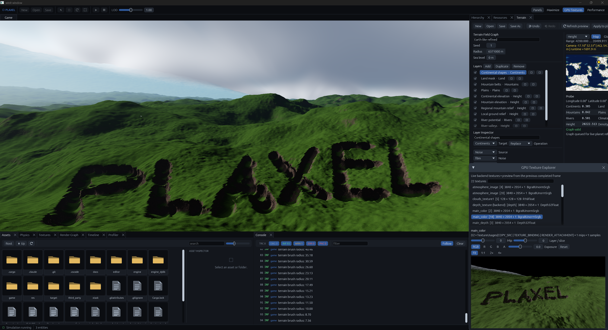
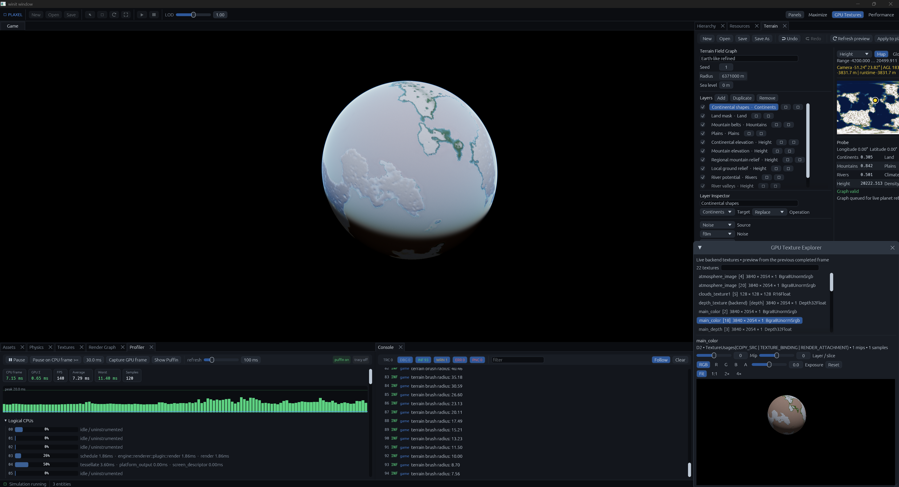

# Plaxel
Plaxel main objectives are high performance and parallelization.
Currently this repository holds code for both engine, editor and game.

# Engine
The engine is only a lib loaded by game. It works very similarly to bevy, using a similar ECS and Plugins. Engine offers all base needs for making the game, like Entity-Component-System (own implementation, not using thirdparty libs), physics using rapier3D, a math lib that uses glam and a jobs system for parallelization.

# Editor
Editor is only made to have easier times while debugging, as it's not the main objective of the engine, AI is extensively used to add new tools to it.
Among many tools, the ones most interesting:
* GPU textures window, to see all gpu loaded textures, so you can check the textures are loading correctly, or textures that are generated by compute shaders are generated properly.
* Render pass nodes visualizator, making it possible to edit settings of the pass via editor
* Profiler: Extensive window that has many options for ideal profiling: Scope profiler, you call a scope profile and then it appears on that window, it profiles all cores too and can show idle cores. GPU passes, to profile how many ms each render pass is taking. Sampling profiler, it uses windows etw to capture each individual function timing, so you don't need to manually specify the scopes to profile. The editor also loads renderdoc with it, so you can press "Capture GPU frame" and it will automatically open renderdoc with that frame.

# Game
The game is currently just at prototype phase. The objective is to make a mix of Space Engineers + Kerbal Space Program. Huge deformable planets with realistic physics.
Currently featuring:
- 6370km radius planets with deformable terrain using dual contouring and octree. You can fly around and LODs will seamlessly load properly.
- A separate octree for adding water meshes, properly using LODs too.
- Volumetric clouds using an weather map, so different parts of the planet can have different cloud shapes.
- Astronomical bodies uses double point precision, while renderer converts everything to be centered around the camera so it can use f32 without issues.
- Atmoshpere shaders, for both surface and space views.

